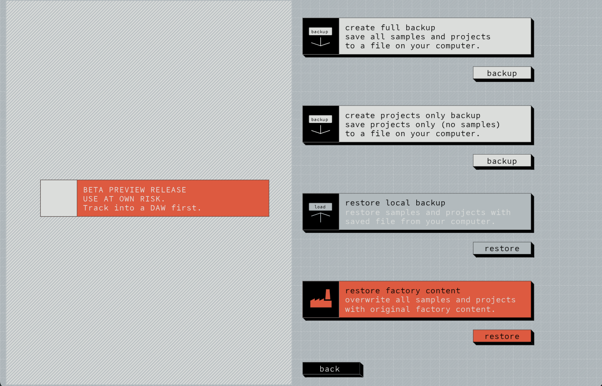
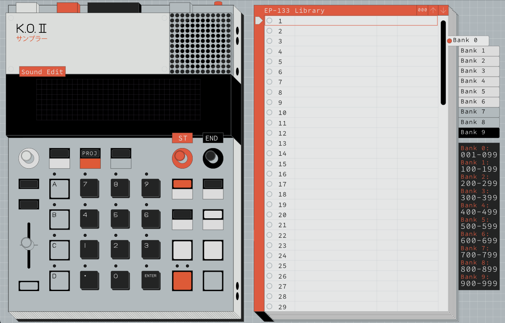
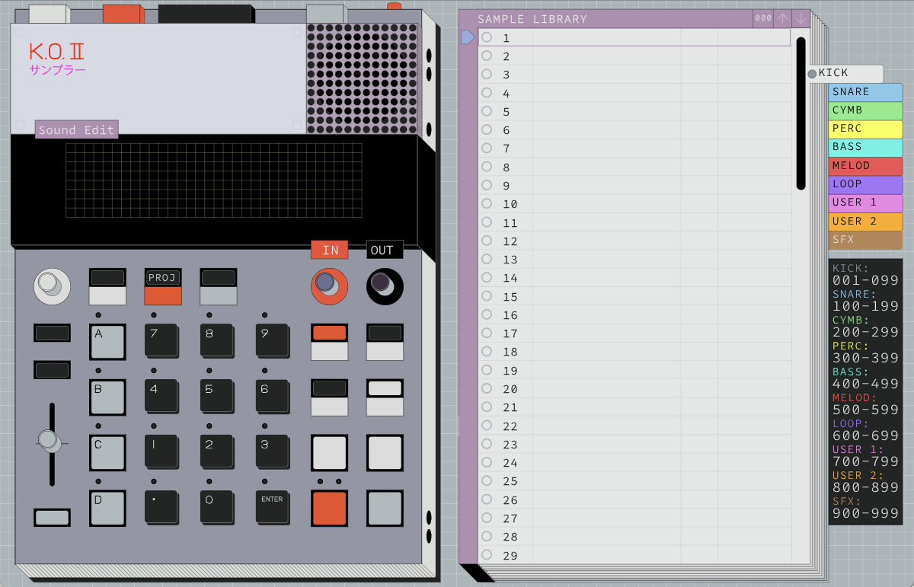
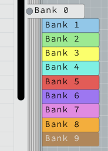
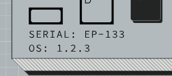
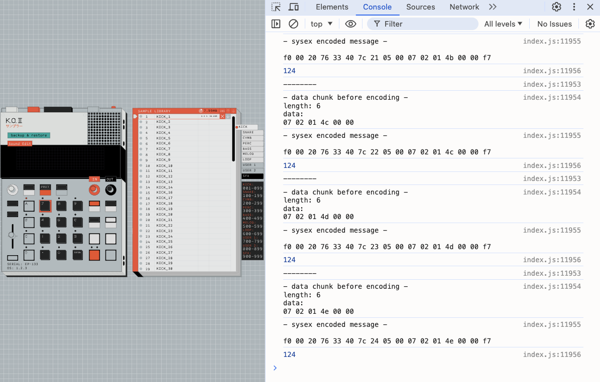

# EP-133 Sample Tool

[](https://github.com/thomasphillips3/ep_133_sample_tool/actions/workflows/build-electron.yml)
[](https://github.com/thomasphillips3/ep_133_sample_tool/actions/workflows/build-android.yml)

> Offline sample management for the Teenage Engineering EP-133 K.O. II.
> Ships as a desktop app (Windows/macOS/Linux), Android app, iOS app, and AU/VST3 plugin.

Compatible with any **EP-133** or **EP-1320**.

---

## Platforms

| Platform | Stack | Min Requirement |
|----------|-------|----------------|
| **Desktop** | Electron + Chromium | Node.js 18+ |
| **Android** | Kotlin + Jetpack Compose | Android 10 (API 29+) |
| **iOS** | Swift + SwiftUI | iOS 16+, Xcode 15+ |
| **DAW Plugin** | C++ + JUCE 8 | macOS, CMake 3.22+ |

---

## Repository Structure

```
ep_133_sample_tool/
├── data/              # Web app — compiled React UI, WASM audio libs, factory pack
├── shared/            # Cross-platform — MIDI polyfill JS, EP-133 pad/sound/scale JSON
├── AndroidApp/        # Native Android app (Kotlin/Compose)
├── iOSApp/            # Native iOS app (Swift/SwiftUI)
├── JucePlugin/        # AU/VST3 plugin (JUCE 8, macOS)
├── scripts/           # Build and release automation (BBM)
├── docs/              # Architecture docs and screenshots
├── .github/workflows/ # CI — Electron, Android
├── main.js            # Electron app entry point
└── package.json       # Electron app config
```

---

## Quick Start

### Desktop (Electron)

```bash
npm install
npm start             # Run in dev mode
npm run package       # Build distributable → dist/
```

Or run the web UI without Electron:
```bash
cd data
python3 -m http.server  # Visit http://localhost:8000
```

→ See [data/README.md](data/README.md)

### Android

```bash
cd AndroidApp
./gradlew assembleDebug                        # Build APK
adb install app/build/outputs/apk/debug/*.apk  # Install on device
```

→ See [AndroidApp/README.md](AndroidApp/README.md)

### iOS

Open `iOSApp/EP133SampleTool.xcodeproj` in Xcode 15+, select your device, and run.

→ See [iOSApp/README.md](iOSApp/README.md)

### JUCE Plugin (macOS)

```bash
cd JucePlugin
cmake -B build -DCMAKE_BUILD_TYPE=Release
cmake --build build --config Release
```

→ See [JucePlugin/README.md](JucePlugin/README.md)

---

## Desktop App Features

**100% fully offline.** No internet connection required. All WebAssembly modules are bundled and the original Factory Sound Pack is included.

**Backup projects only.** Standard backup saves all sounds and projects. This tool adds a "Projects Only" option — faster to backup and restore, preserves your base sounds.



**Better zoom.** Zoom into the parts of the UI that matter without losing access to controls.



**Custom color schemes and group names.** Edit `data/custom.js` to remap any color or rename sample groups.




**Serial number removed.** The device serial number is stripped from the UI, backup filenames, and `meta.json` inside the backup archive. Share backups freely.



**Data tracking removed.** All telemetry and tracking calls have been disabled.

**MIDI-SysEx debug.** Open DevTools (`View > Toggle Developer Tools`) to inspect raw SysEx messages between the app and your EP-133. Useful for protocol reverse-engineering.



---

## Architecture

This is a **web-app-first monorepo**. A single compiled React application (`data/`) runs inside every platform wrapper. Native code handles MIDI connectivity; the web app handles everything else.

- **Web app** (`data/`) — all sample management UI, SysEx protocol, audio processing (WASM)
- **MIDI polyfill** (`shared/MIDIBridgePolyfill.js`) — bridges Web MIDI API to each native MIDI stack
- **Native wrappers** — Electron, Android WebView + Kotlin/Compose native screens, iOS WKWebView, JUCE WebBrowserComponent

→ [docs/architecture.md](docs/architecture.md) for the full data flow and platform routing table.

---

## Troubleshooting

**Connectivity issues:** Click `View > Reload` to refresh the app.

**App won't start:** Try the [web server method](#quick-start) as a fallback.

---

## Contributing

→ [CONTRIBUTING.md](CONTRIBUTING.md)
